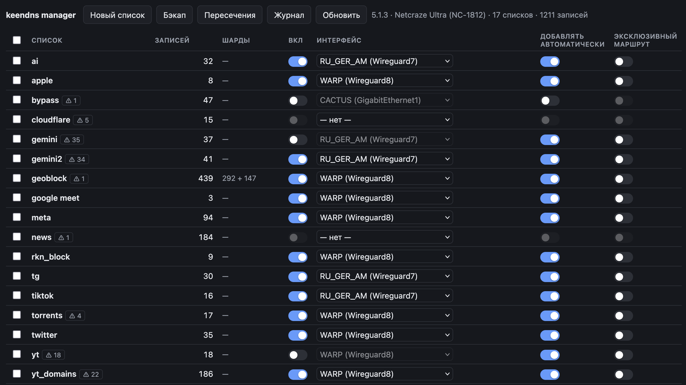

# keendns manager

Штатная веб-морда роутера не умеет в групповые изменения интерфейсов, а список длиннее 300 записей приходится вручную резать на части и для
каждой заводить отдельное правило маршрутизации.



Данное решение предоставляет веб-интерфейс для списков DNS-маршрутизации Keenetic (KeeneticOS 5.0+):
массовая заливка доменов, готовые списки сервисов из
[allow-domains](https://github.com/itdoginfo/allow-domains) с регулярной
синхронизацией, групповая смена интерфейса и автоматическое шардирование
при превышении лимита в 300 записей.


## Что умеет

- **Массовое создание списков** Список — это textarea: по домену, IP или подсети в
  строке. Комментарии `#`, ведущие `*.` и точки, дубли — вычищаются сами.
  Можно загрузить файлом или взять готовый пресет (см. ниже).
- **Автосплит списка.** Список больше 300 записей автоматически раскладывается
  по нескольким `имя_1`, `имя_2`, `имя_3`; маршрут новому шарду копируется с
  исходного. В таблице такие шарды показаны одной строкой.
- **Пресеты из allow-domains и ночная синхронизация.** Сервисы, категории и
  страны из репозитория itdoginfo — одним выбором в диалоге. Список из пресета
  сверяется с источником каждую ночь. Подробности — в разделе
  [Списки из allow-domains](#списки-из-allow-domains).
- **Групповая смена интерфейса.** Отмечаешь любое количество списков,
  выбираешь подключение в нижней панели — маршруты переписываются у всех
  шардов.
- **Маршрут выпадающим списком в самой строке.** Один список — один клик:
  выбор подключения создаёт или переносит маршрут, «нет маршрута» его снимает,
  список остаётся. Новый маршрут получает `auto`, как и на странице роутера.
- **Три переключателя у каждого маршрута** — «Вкл», «Добавлять автоматически»
  и «Эксклюзивный маршрут», как на странице роутера.
- **Проверка пересечений.** Роутер включает все субдомены записи автоматически,
  поэтому `x.com` в одном списке молча перекрывает `grok.x.com` в другом —
  глазами такое не заметить. Кнопка «Пересечения» и метка `⚠ N` в строке
  показывают, что и чем перекрыто, с градацией: красным — живые конфликты
  (оба маршрута активны, интерфейсы разные), серым — спящие (у одной стороны
  маршрута нет или он выключен) и безвредные дубли на одном интерфейсе.
  Вложенные подсети (`104.24.0.0/14` внутри `104.16.0.0/12`) тоже находятся.
  У каждой пары — кнопки «Убрать из <списка>», снимающие все перекрытые
  записи разом.
- **Уплотнить** — перепаковать шарды после удалений и убрать опустевшие.
- **Бэкап** — выгрузка всего состояния в JSON.

Перед отправкой всегда показывается план: точный список CLI-команд, которые
уйдут на роутер. После применения конфигурация сохраняется в флеш.

## Списки из allow-domains

Репозиторий [itdoginfo/allow-domains](https://github.com/itdoginfo/allow-domains)
ведёт списки доменов и подсетей по сервисам, категориям и странам и обновляет
их по расписанию. Менеджер умеет брать их напрямую.

### Пресет в диалоге списка

В диалоге «Новый список» или «Правка» рядом с кнопкой файла — выпадашка
«Из allow-domains…» с тремя группами:

| Группа | Что внутри |
|---|---|
| Сервисы | youtube, telegram, discord, meta, twitter, tiktok, hdrezka, roblox, google_ai, google_meet, google_play, cloudflare, cloudfront, digitalocean, hetzner, ovh |
| Категории | anime, block, geoblock, hodca, news, porn |
| Страны | russia-inside, russia-outside, ukraine-inside |

У сервиса домены и подсети IPv4 приезжают **в один список** — подпись в
выпадашке говорит о составе: «telegram (домены + подсети)», «hetzner (подсети)».
Выбор дописывает записи в поле, как загрузка файла; имя списка подставляется,
если поле пустое. Дальше — обычный путь: «Сохранить» → план → «Применить».

Скачивает файлы лаунчер, не браузер: если GitHub недоступен, диалог покажет
ошибку, а список можно загрузить файлом вручную.

### Ночная синхронизация

После выбора пресета в диалоге появляется галка **«синхронизировать
ежедневно»**, включённая по умолчанию. Такой список помечен в таблице `⟳`;
раз в сутки (по умолчанию в 04:00 по локальному времени лаунчера) он
сверяется с репозиторием.

Как это работает:

- **Только разница.** Лаунчер читает, что лежит на роутере, сравнивает с
  источником и шлёт `include` для новых записей и `no include` для исчезнувших.
  Список никогда не пересоздаётся. Нет разницы — на роутер не уходит ничего.
- **Зеркало.** Список повторяет источник, поэтому ручные правки в нём ночью
  откатятся. Свои домены держи в отдельном списке — диалог правки
  синхронизируемого списка об этом предупреждает.
- **Не трогается:** маршрут, флаги `auto`/`reject`, раскладка по шардам.
- **Шарды не пересобираются.** Если новым записям не хватило места (реально —
  только у `russia-inside`, он на 4 шарда), в подсказке `⟳` появится
  «не влезло N»: открой список, выбери пресет ещё раз и сохрани — обычный
  автосплит доложит недостающее.
- **Клик по `⟳`** запускает сверку сейчас; подсказка показывает время и итог
  последней (`+2 −0`). Красная метка — была ошибка или переполнение.
- **Снять галку** можно в диалоге списка. Если список удалить, лаунчер забудет
  о нём при следующей сверке сам.
- **Переименование** списка связь с пресетом не рвёт.

Синхронизация идёт, пока лаунчер запущен: для ночной работы он должен жить
как сервис или контейнер. Что синхронизируется и как прошла последняя
сверка — в файле `keendns-sync.json` (путь настраивается, см. ниже).

## Запуск

Нужен только Python 3 — ни зависимостей, ни сборки. На macOS и в большинстве
дистрибутивов Linux он уже есть; в Windows ставится из Microsoft Store, и
команда там называется `python`, а не `python3`.

Положи `keendns.py` и `keendns.html` в одну папку и запусти:

```sh
python3 keendns.py
```

Скрипт спросит пароль администратора роутера и откроет браузер.

По умолчанию он идёт на `192.168.1.1` с логином `admin` — заводские значения
Keenetic. Если роутер переехал:

```sh
python3 keendns.py --host 192.168.2.1
python3 keendns.py --host 192.168.2.1 --user myadmin --port 9000
```

Пароль живёт только в памяти процесса: не пишется на диск и не попадает
в браузер. Сессия роутера истекает через 5 минут, лаунчер переподключается сам.

### Настройки

Каждый флаг дублируется переменной окружения — чтобы не повторять его при
каждом запуске и чтобы задавать в контейнере.

| Флаг | Переменная | По умолчанию | Что делает |
|---|---|---|---|
| `--host` | `KEENETIC_HOST` | `192.168.1.1` | адрес роутера |
| `--user` | `KEENETIC_USER` | `admin` | логин |
| — | `KEENETIC_PASSWORD` | спросит в терминале | пароль; в обычной работе лучше вводить руками |
| `--port` | — | `8765` | локальный порт |
| `--bind` | `KEENDNS_BIND` | `127.0.0.1` | адрес, на котором слушать |
| `--log FILE` | `KEENDNS_LOG` | — | дублировать журнал команд в файл |
| `--state FILE` | `KEENDNS_STATE` | `keendns-sync.json` рядом со скриптом | какие списки синхронизируются с allow-domains |
| `--sync-hour N` | `KEENDNS_SYNC_HOUR` | `4` | час ночной сверки, по локальному времени |
| `--no-browser` | — | — | не открывать браузер |
| `--selftest` | — | — | прогнать встроенные проверки и выйти |

### В контейнере

Всё то же самое, но параметры передаются переменными окружения. Пароль
обязателен: спросить его в контейнере некому.

```sh
docker build -t keendns-manager .
docker run -d --name keendns-manager \
  -e KEENETIC_HOST=192.168.1.1 \
  -e KEENETIC_USER=admin \
  -e KEENETIC_PASSWORD='...' \
  -e TZ=Europe/Moscow \
  -v keendns-data:/data \
  -p 127.0.0.1:8765:8765 \
  keendns-manager
```

Или через compose — положи пароль в `.env` рядом с `docker-compose.yml`
(`KEENETIC_PASSWORD=...`, плюс `KEENETIC_HOST=` при другом адресе):

```sh
docker compose up -d
```

Две вещи, которых нет в запуске напрямую:

- **Том `keendns-data`** монтируется в `/data`, там лежит `keendns-sync.json`.
  Без тома список синхронизируемых пресетов пропадёт при пересборке образа.
  Именованный том, а не папка с хоста: процесс работает от `nobody`, и
  bind-mount для него был бы read-only.
- **`TZ`** (по умолчанию `Europe/Moscow`) — «04:00» ночной сверки считается по
  часовому поясу контейнера, без `TZ` это было бы 04:00 UTC.

Дальше открывай `http://127.0.0.1:8765/`.

**Порт публикуется на `127.0.0.1` не случайно.** Кто дотянулся до этого порта,
тот уже авторизован на роутере — менеджер не спрашивает пароль повторно.
Не меняй на `-p 8765:8765`, иначе управление роутером станет доступно всей сети.

Внутри контейнера сервер слушает `0.0.0.0` (переменная `KEENDNS_BIND`), иначе
проброс порта не работал бы. Запущенный напрямую, он слушает только
`127.0.0.1`.

## Проверка и логи

```sh
open http://127.0.0.1:8765/?selftest   # тесты раскладки и генерации команд
python3 keendns.py --selftest          # тесты нормализации и ночной сверки
```

Кнопка **«Журнал»** в панели показывает по каждому действию: что отправлено,
что ответил роутер и что показало следующее чтение. Если роутер согласился,
а состояние не изменилось, в журнале появляется предупреждение — именно так
был найден баг с адресацией правил. Там же видно `⚠ строк маршрута N на M
шард(ов)` — признак дубликата правила.

Лаунчер пишет то же самое в терминал, а с `--log FILE`
(или `KEENDNS_LOG=/path`) — ещё и в файл. Ночная сверка пишет туда же:
`sync: next run at …` при старте, затем каждую команду и итог по списку
(`sync telegram: +2 −0`).

## Как это устроено

`keendns.html` — весь интерфейс и вся логика списков: раскладка по шардам,
генерация команд, пересечения. `keendns.py` — лаунчер: отдаёт страницу,
логинится на роутер, проксирует RCI, скачивает пресеты allow-domains и по
ночам сверяет с ними помеченные списки. Сверка — единственная логика,
живущая на сервере: браузер в четыре утра закрыт. Она нарочно узкая — только
`include`/`no include` в существующих шардах — чтобы не дублировать в Python
раскладку по шардам со всеми её граблями.

Прокси нужен не для удобства: роутер отбивает запросы с чужого origin
(`403, invalid origin`) и помечает сессионную cookie `SameSite=Strict`, так что
страница, открытая с диска или с localhost, обратиться к `/rci` не может.
Заодно в лаунчере лежит вход по challenge — в браузерном WebCrypto нет MD5.

### Модель роутера

Проверено на KeeneticOS 5.1.3 (Netcraze Ultra NC-1812):

```
object-group fqdn domain-listN                     # список, адресуется по id
object-group fqdn domain-listN description "yt_2"  # имя, видимое в веб-морде
object-group fqdn domain-listN include example.com # запись: домен, IP или CIDR
dns-proxy route object-group domain-listN Wireguard8 auto [reject]
no dns-proxy route object-group domain-listN Wireguard8
```

Включение и выключение маршрута через CLI недоступно (`no such command: disable`)
— оно идёт структурированным деревом RCI, и правило адресуется **только** своим
`index` из `show rc dns-proxy`:

```json
{"dns-proxy": {"route": {"index": "<index правила>", "disable": true}}}
```

Пять особенностей, которые пришлось учесть:

1. **Адресация правила по `object-group` не работает, но и не сообщает об
   ошибке.** Роутер отвечает `enabled the DNS route rule N` — и применяет
   команду к **последнему** правилу в списке, а не к запрошенному. То есть
   переключение молча трогает чужой маршрут, оставляя нужный без изменений.
2. **Повторный `dns-proxy route` не заменяет маршрут, а добавляет второй** —
   поэтому смена интерфейса всегда идёт «снять → поставить».
3. **При удалении маршрута флаги не принимаются**: `no ... Wireguard8 auto`
   отвечает `no such command: auto`.
4. Имена списков — служебные `domain-listN`, человекочитаемое имя лежит
   в `description`; менеджер занимает наименьший свободный номер, как это
   делает сам роутер.
5. **Дерево настроек всегда отвечает ложной ошибкой** `no input` (код 7471107)
   рядом с настоящим результатом во вложенном `disable.status`. Без фильтра по
   этому коду успешное переключение читалось бы как сбой.

`auto` и `reject` деревом не меняются вовсе — оно их молча игнорирует. Их
переключение идёт пересозданием маршрута, а `reject` роутер держит только
вместе с `auto`. Пересозданное правило приходит включённым и с **новым**
`index`, поэтому выключенность восстанавливается вторым проходом — по индексам,
прочитанным уже после пересоздания.

Запись идёт через `{"parse": "<CLI-команда>"}` — JSON-схема на каждую сущность
не нужна. Команды уходят батчами по 500 (`RCI_CHUNK` в `keendns.py`): 709
команд одним запросом проходят без таймаута, а ~15 000 (около 1 МБ) роутер
отбрасывает как `content oversize` и после нескольких таких запросов **банит
IP отправителя на 15 минут** (`Netfilter::Lockout::Manager "Http"`). В бане
порт 80 для этого хоста молчит: менеджер не может залогиниться и выглядит
«упавшим», пока бан не истечёт. Смотреть `show log` роутера.

### Раскладка по шардам

Новые записи докладываются в шард со свободным местом, существующие остаются
там, где лежат. Добавление одного домена в список из 700 записей — одна команда,
а не переписывание всех трёх шардов. Перепаковка — только по кнопке «Уплотнить».

Лимит 300 в документации Keenetic не описан — он взят из практики (максимум
по существующим группам ровно 300). Это свойство прошивки, а не настройка,
поэтому в интерфейс не выведен: константа `LIMIT` в начале скрипта
`keendns.html` и её близнец в `keendns.py`.
